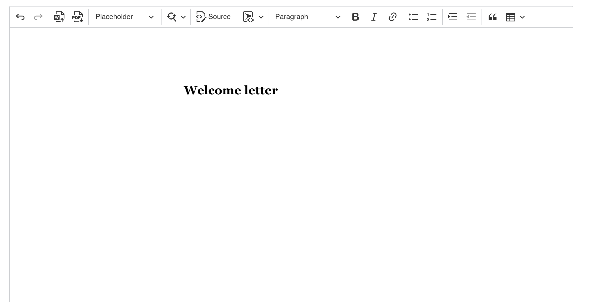

# wind-file-sdk

> 文件处理、渲染、编辑工具包，编辑器基于 [CKEditor5](https://ckeditor.com/ckeditor-5/) 做自定义构建，在编辑器的工具栏里扩展了一些如：pdf 下载、占位符、word 导入等插件; 支持对 docx 文件的预览和编辑，支持 html 转 PDF 的下载。

## 安装与使用

```bash
pnpm add wind-file-sdk
```

```typescript
import FileSdk from 'wind-file-sdk';
```

## API 接口

### createEditor: 创建一个 editor 实例

```typescript
export interface IEditorConfig {
  placeholderConfig?: { type: 'select'; options: string[] } | { type: 'input' };
  outSource?: 'markdown' | 'html';
  width: number;
  height: number;
  hideToolbarItems: ToolBarItem[]
}

// 创建 editor 实例
FileSdk.createEditor('#editor', {
      placeholderConfig: { type: 'select', options: ['value1', 'value2']}, // 不传 placeholderConfig 配置时默认以 input 形式
      hideToolbarItems: ['exportToPDF', 'importFromWord'], // 需要隐藏的工具栏插件
      height: 800
    })
      .then((value) => {
        // value 为 editor instance, 在 react 里可以定义一个 ref 进行赋值
        editor.current = value;
      })
      .catch((error) => {
        console.error(error);
      });
···
// 设置/获取数据
editor.current.getData() // 默认输出的是 html 格式
editor.current.setData() // 设置数据
editor.current.getInsertPlaceholders() // 获取所有插入的占位符数据
```

编辑器集成了一些特色功能，如果有更多需求，也可以扩展更多的插件进行支持

- 可以通过导入 word 插件将 DOCX 文档转换成 HTML 并且在 editor 里编辑
- 支持将 html 导出为 pdf
- 支持占位符变量替换
- 支持查找替换功能
- 可以通过 Source 直接转换成 html 源码编辑
- ...

#### Screenshot



### docxPreview: 基于 docx-preview 接收一个 docx 文件并转成 html 进行预览

```typescript
export interface Options {
  inWrapper: boolean; // 是否给文档添加背景样式
  className: string; // 预览文档的样式类名
}

FileSdk.docxPreview(file, '#preview');
FileSdk.docxPreview(file, '#preview', { className: 'preview', inWrapper: true });
```

### htmlToPdf: 基于 html2pdf 的 pdf 下载功能，优化了原有的 pdf 格式

```typescript
const html = '...' // 获取一段 html 字符串
FileSdk.htmlToPdf(html, 'abi-file') //导出名为 abi-file 的 pdf 文件
FileSdk.htmlToPdf(html, 'abi-file', {
    margin: [5, 0, 5, 0],
    ...
})
```

#### config 配置可参考

<figure class="table">
    <table style="-webkit-text-stroke-width:0px;border-collapse:collapse;border-spacing:0px;box-sizing:border-box;color:rgb(96, 108, 113);display:block;font-family:&quot;Open Sans&quot;, &quot;Helvetica Neue&quot;, Helvetica, Arial, sans-serif;font-size:17.6px;font-style:normal;font-variant-caps:normal;font-variant-ligatures:normal;font-weight:400;letter-spacing:normal;orphans:2;overflow:auto;text-align:start;text-decoration-color:initial;text-decoration-style:initial;text-decoration-thickness:initial;text-transform:none;white-space:normal;widows:2;width:832px;word-break:keep-all;word-spacing:0px;">
        <thead style="box-sizing:border-box;margin-top:0px;">
            <tr style="box-sizing:border-box;margin-top:0px;">
                <th style="border:1px solid rgb(233, 235, 236);box-sizing:border-box;margin-top:0px;padding:0.5rem 1rem;">
                    <strong>Name</strong>
                </th>
                <th style="border:1px solid rgb(233, 235, 236);box-sizing:border-box;padding:0.5rem 1rem;">
                    <strong>Type</strong>
                </th>
                <th style="border:1px solid rgb(233, 235, 236);box-sizing:border-box;padding:0.5rem 1rem;">
                    <strong>Default</strong>
                </th>
                <th style="border:1px solid rgb(233, 235, 236);box-sizing:border-box;padding:0.5rem 1rem;">
                    <strong>Description</strong>
                </th>
            </tr>
        </thead>
        <tbody style="box-sizing:border-box;">
            <tr style="box-sizing:border-box;margin-top:0px;">
                <td style="border:1px solid rgb(233, 235, 236);box-sizing:border-box;margin-top:0px;padding:0.5rem 1rem;">
                    margin
                </td>
                <td style="border:1px solid rgb(233, 235, 236);box-sizing:border-box;padding:0.5rem 1rem;">
                    number or array
                </td>
                <td style="border:1px solid rgb(233, 235, 236);box-sizing:border-box;padding:0.5rem 1rem;">
                    <code class="language-plaintext highlighter-rouge" style="background-color:rgb(243, 246, 250);border-radius:0.3rem;box-sizing:border-box;color:rgb(86, 116, 130);font-family:Consolas, &quot;Liberation Mono&quot;, Menlo, Courier, monospace;font-size:0.9rem;margin-top:0px;padding:2px 4px;">0</code>
                </td>
                <td style="border:1px solid rgb(233, 235, 236);box-sizing:border-box;padding:0.5rem 1rem;">
                    PDF 页面间距 (in jsPDF units). 格式为 number 或, <code class="language-plaintext highlighter-rouge" style="background-color:rgb(243, 246, 250);border-radius:0.3rem;box-sizing:border-box;color:rgb(86, 116, 130);font-family:Consolas, &quot;Liberation Mono&quot;, Menlo, Courier, monospace;font-size:0.9rem;margin-top:0px;padding:2px 4px;">[vMargin, hMargin]</code>, 或 <code class="language-plaintext highlighter-rouge" style="background-color:rgb(243, 246, 250);border-radius:0.3rem;box-sizing:border-box;color:rgb(86, 116, 130);font-family:Consolas, &quot;Liberation Mono&quot;, Menlo, Courier, monospace;font-size:0.9rem;padding:2px 4px;">[top, left, bottom, right]</code>.
                </td>
            </tr>
            <tr style="box-sizing:border-box;">
                <td style="border:1px solid rgb(233, 235, 236);box-sizing:border-box;margin-top:0px;padding:0.5rem 1rem;">
                    filename
                </td>
                <td style="border:1px solid rgb(233, 235, 236);box-sizing:border-box;padding:0.5rem 1rem;">
                    string
                </td>
                <td style="border:1px solid rgb(233, 235, 236);box-sizing:border-box;padding:0.5rem 1rem;">
                    <code class="language-plaintext highlighter-rouge" style="background-color:rgb(243, 246, 250);border-radius:0.3rem;box-sizing:border-box;color:rgb(86, 116, 130);font-family:Consolas, &quot;Liberation Mono&quot;, Menlo, Courier, monospace;font-size:0.9rem;margin-top:0px;padding:2px 4px;">'file.pdf'</code>
                </td>
                <td style="border:1px solid rgb(233, 235, 236);box-sizing:border-box;padding:0.5rem 1rem;">
                    导出的 PDF 文件名
                </td>
            </tr>
            <tr style="box-sizing:border-box;">
                <td style="border:1px solid rgb(233, 235, 236);box-sizing:border-box;margin-top:0px;padding:0.5rem 1rem;">
                    pagebreak
                </td>
                <td style="border:1px solid rgb(233, 235, 236);box-sizing:border-box;padding:0.5rem 1rem;">
                    object
                </td>
                <td style="border:1px solid rgb(233, 235, 236);box-sizing:border-box;padding:0.5rem 1rem;">
                    <code class="language-plaintext highlighter-rouge" style="background-color:rgb(243, 246, 250);border-radius:0.3rem;box-sizing:border-box;color:rgb(86, 116, 130);font-family:Consolas, &quot;Liberation Mono&quot;, Menlo, Courier, monospace;font-size:0.9rem;margin-top:0px;padding:2px 4px;">{mode: ['css', 'legacy']}</code>
                </td>
                <td style="border:1px solid rgb(233, 235, 236);box-sizing:border-box;padding:0.5rem 1rem;">
                    控制页面的分页行为. 更多细节可参考 <a style="background-color:transparent;box-sizing:border-box;color:rgb(30, 107, 184);margin-top:0px;text-decoration:none;" href="https://ekoopmans.github.io/html2pdf.js/#page-breaks">Page-breaks</a>
                </td>
            </tr>
            <tr style="box-sizing:border-box;">
                <td style="border:1px solid rgb(233, 235, 236);box-sizing:border-box;margin-top:0px;padding:0.5rem 1rem;">
                    image
                </td>
                <td style="border:1px solid rgb(233, 235, 236);box-sizing:border-box;padding:0.5rem 1rem;">
                    object
                </td>
                <td style="border:1px solid rgb(233, 235, 236);box-sizing:border-box;padding:0.5rem 1rem;">
                    <code class="language-plaintext highlighter-rouge" style="background-color:rgb(243, 246, 250);border-radius:0.3rem;box-sizing:border-box;color:rgb(86, 116, 130);font-family:Consolas, &quot;Liberation Mono&quot;, Menlo, Courier, monospace;font-size:0.9rem;margin-top:0px;padding:2px 4px;">{type: 'jpeg', quality: 0.95}</code>
                </td>
                <td style="border:1px solid rgb(233, 235, 236);box-sizing:border-box;padding:0.5rem 1rem;">
                    设置生成 PDF 的图片类型和质量，更多细节可参考 <a style="background-color:transparent;box-sizing:border-box;color:rgb(30, 107, 184);margin-top:0px;text-decoration:none;" href="https://ekoopmans.github.io/html2pdf.js/#image-type-and-quality">Image type and quality</a>
                </td>
            </tr>
            <tr style="box-sizing:border-box;">
                <td style="border:1px solid rgb(233, 235, 236);box-sizing:border-box;margin-top:0px;padding:0.5rem 1rem;">
                    enableLinks
                </td>
                <td style="border:1px solid rgb(233, 235, 236);box-sizing:border-box;padding:0.5rem 1rem;">
                    boolean
                </td>
                <td style="border:1px solid rgb(233, 235, 236);box-sizing:border-box;padding:0.5rem 1rem;">
                    <code class="language-plaintext highlighter-rouge" style="background-color:rgb(243, 246, 250);border-radius:0.3rem;box-sizing:border-box;color:rgb(86, 116, 130);font-family:Consolas, &quot;Liberation Mono&quot;, Menlo, Courier, monospace;font-size:0.9rem;margin-top:0px;padding:2px 4px;">true</code>
                </td>
                <td style="border:1px solid rgb(233, 235, 236);box-sizing:border-box;padding:0.5rem 1rem;">
                    如果启用，PDF 超链接会自动添加到所有锚标记之上
                </td>
            </tr>
            <tr style="box-sizing:border-box;">
                <td style="border:1px solid rgb(233, 235, 236);box-sizing:border-box;margin-top:0px;padding:0.5rem 1rem;">
                    html2canvas
                </td>
                <td style="border:1px solid rgb(233, 235, 236);box-sizing:border-box;padding:0.5rem 1rem;">
                    object
                </td>
                <td style="border:1px solid rgb(233, 235, 236);box-sizing:border-box;padding:0.5rem 1rem;">
                    <code class="language-plaintext highlighter-rouge" style="background-color:rgb(243, 246, 250);border-radius:0.3rem;box-sizing:border-box;color:rgb(86, 116, 130);font-family:Consolas, &quot;Liberation Mono&quot;, Menlo, Courier, monospace;font-size:0.9rem;margin-top:0px;padding:2px 4px;">{ }</code>
                </td>
                <td style="border:1px solid rgb(233, 235, 236);box-sizing:border-box;padding:0.5rem 1rem;">
                    <code class="language-plaintext highlighter-rouge" style="background-color:rgb(243, 246, 250);border-radius:0.3rem;box-sizing:border-box;color:rgb(86, 116, 130);font-family:Consolas, &quot;Liberation Mono&quot;, Menlo, Courier, monospace;font-size:0.9rem;margin-top:0px;padding:2px 4px;">html2canvas</code> (<a style="background-color:transparent;box-sizing:border-box;color:rgb(30, 107, 184);text-decoration:none;" href="https://html2canvas.hertzen.com/configuration">配置</a> ).
                </td>
            </tr>
            <tr style="box-sizing:border-box;">
                <td style="border:1px solid rgb(233, 235, 236);box-sizing:border-box;margin-top:0px;padding:0.5rem 1rem;">
                    jsPDF
                </td>
                <td style="border:1px solid rgb(233, 235, 236);box-sizing:border-box;padding:0.5rem 1rem;">
                    object
                </td>
                <td style="border:1px solid rgb(233, 235, 236);box-sizing:border-box;padding:0.5rem 1rem;">
                    <code class="language-plaintext highlighter-rouge" style="background-color:rgb(243, 246, 250);border-radius:0.3rem;box-sizing:border-box;color:rgb(86, 116, 130);font-family:Consolas, &quot;Liberation Mono&quot;, Menlo, Courier, monospace;font-size:0.9rem;margin-top:0px;padding:2px 4px;">{ }</code>
                </td>
                <td style="border:1px solid rgb(233, 235, 236);box-sizing:border-box;padding:0.5rem 1rem;">
                     <code class="language-plaintext highlighter-rouge" style="background-color:rgb(243, 246, 250);border-radius:0.3rem;box-sizing:border-box;color:rgb(86, 116, 130);font-family:Consolas, &quot;Liberation Mono&quot;, Menlo, Courier, monospace;font-size:0.9rem;margin-top:0px;padding:2px 4px;">jsPDF</code> (<a style="background-color:transparent;box-sizing:border-box;color:rgb(30, 107, 184);text-decoration:none;" href="http://rawgit.com/MrRio/jsPDF/master/docs/jsPDF.html">配置</a>).
                </td>
            </tr>
        </tbody>
    </table>
</figure>

### htmlPreview: 渲染一段 html 进行预览

```typescript
const html = '...'; // 获取一段 html 字符串
FileSdk.htmlPreview('#preview', html);
```

## License

Licensed under the [MIT](/LICENSE) License.
